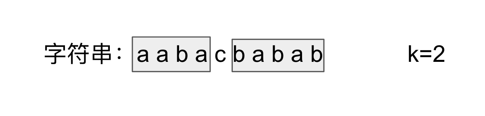

#### 424. Longest Repeating Character Replacement
这个解释讲的很详细：https://www.cnblogs.com/grandyang/p/5999050.html
这道题给我们了一个字符串，说我们有k次随意置换任意字符的机会，让我们找出最长的重复字符的字符串。这道题跟之前那道 Longest Substring with At Most K Distinct Characters 很像，都需要用滑动窗口 Sliding Window 来解。我们首先来想，如果没有k的限制，让我们求把字符串变成只有一个字符重复的字符串需要的最小置换次数，那么就是字符串的总长度减去出现次数最多的字符的个数。如果加上k的限制，我们其实就是求满足 (子字符串的长度减去出现次数最多的字符个数)<=k 的最大子字符串长度即可，搞清了这一点，我们也就应该知道怎么用滑动窗口来解了吧。我们用一个变量 start 记录滑动窗口左边界，初始化为0，然后遍历字符串，每次累加出现字符的个数，然后更新出现最多字符的个数，然后我们判断当前滑动窗口是否满足之前说的那个条件，如果不满足，我们就把滑动窗口左边界向右移动一个，并注意去掉的字符要在 counts 里减一，直到满足条件，我们更新结果 res 即可。需要注意的是，当滑动窗口的左边界向右移动了后，窗口内的相同字母的最大个数貌似可能会改变啊，为啥这里不用更新 maxCnt 呢？这是个好问题，原因是此题让求的是最长的重复子串，maxCnt 相当于卡了一个窗口大小，我们并不希望窗口变小，虽然窗口在滑动，但是之前是出现过跟窗口大小相同的符合题意的子串，缩小窗口没有意义，并不会使结果 res 变大，所以我们才不更新 maxCnt 的
```java
class Solution {
    public int characterReplacement(String s, int k) {
        int len = s.length();
        int[] count = new int[26];
        int start = 0, maxCount = 0, maxLength = 0;
        for (int end = 0; end < len; end++) {
            maxCount = Math.max(maxCount, ++count[s.charAt(end) - 'A']);
            while (end - start + 1 - maxCount > k) {
                count[s.charAt(start) - 'A']--;
                start++;
            }
            maxLength = Math.max(maxLength, end - start + 1);
        }
        return maxLength;
    }
}
```

#### 对比看340. Longest Substring with At Most K Distinct Characters
这道题是求最大长度内的district character不超过K， 这里只考虑distinct的，而上题要的是被替换的个数。比如aaaaabbbb，distinct的character是2个，但是如果被替换成相同的character的话，最少要替换4个b，这就是这两道题的区别。
```java
class Solution {
    public int lengthOfLongestSubstringKDistinct(String s, int k) {
        if (s == null || s.length() == 0 || k == 0)
            return 0;

        Map<Character, Integer> map = new HashMap<>();

        int counter = 0;        
        int i = 0, j = 0;
        int res = 0;
        
         while (j < s.length()) {
            char c = s.charAt(j);
            map.put(c, map.getOrDefault(c, 0) + 1);
            if (map.get(c) == 1)
                counter++;
            j++;

            while (i < j && counter > k) {
                char cc = s.charAt(i);
                map.put(cc, map.get(cc) - 1);
                if (map.get(cc) == 0)
                    counter--;
                i++;
            }
            res = Math.max(res, j - i);
        }
        return res;
    }
}
```

#### 再看395. Longest Substring with At Least K Repeating Characters
* 统计原始字符串s中各字符的出现次数，统计其中出现次数少于k次的字符，得到数组filters。
* 若filters为空数组，则直接返回s的长度。
* 以filters为分隔符，将s拆分为若干子串，分别递归计算各子串的结果，返回最大值。

```java
    public int longestSubstring(String s, int k) {
        HashMap<Character, Integer> counter = new HashMap<>();

        for (int i = 0; i < s.length(); i++) {
            char c = s.charAt(i);
            if (counter.containsKey(c)) counter.put(c, counter.get(c) + 1);
            else counter.put(c, 1);
        }

        Set<Character> splitSet = new HashSet<>();
        for (char c : counter.keySet()) {
            if (counter.get(c) < k)
                splitSet.add(c);
        }
        if (splitSet.isEmpty())
            return s.length();

        int max = 0;
        int i = 0, j = 0;
        while (j < s.length()) {
            char c = s.charAt(j);
            if (splitSet.contains(c)) {
                if (j != i)
                    max = Math.max(max, longestSubstring(s.substring(i, j), k));
                i = j + 1;
            }
            j++;
        }
        // 不要忘了最后一段窗口
        if (i != j)
            max = Math.max(max, longestSubstring(s.substring(i, j), k));

        return max;
    }
```

#### 最为常见的滑动窗口题目3. Longest Substring Without Repeating Characters
直接套双指针的模版
```java
class Solution {
    public int lengthOfLongestSubstring(String s) {
        if (s == null) return 0;
        Map<Character, Integer> map = new HashMap<>();
        int i = 0, j = 0;
        int counter = 0;
        int res = 0;
        
        while (j < s.length()) {
            char c = s.charAt(j++);
            map.put(c, map.getOrDefault(c, 0) + 1);
            if (map.get(c) > 1) counter++;
            
            while (counter > 0) {
                char ch = s.charAt(i++);
                map.put(ch, map.get(ch) - 1);
                if (map.get(ch) > 0) counter--;
            }
            res = Math.max(res, j-i);
        }
        return res;
    }
}
```

#### 159. Longest Substring with At Most Two Distinct Characters
一样套模版

```java
class Solution {
    public int lengthOfLongestSubstringTwoDistinct(String s) {
        if (s == null || s.length() == 0) return 0;

        int begin = 0, end = 0;
        int res = 0;
        int counter = 0;
        Map<Character, Integer> map = new HashMap<>();
        while (end < s.length()) {
            char c = s.charAt(end);
            map.put(c, map.getOrDefault(c, 0) + 1);
            if (map.get(c) == 1) counter++;
            end++;
            
            while (counter > 2) {
                char cc = s.charAt(begin);
                map.put(cc, map.get(cc) - 1);
                if (map.get(cc) == 0)
                    counter--;
                begin++;
            }
            res = Math.max(res, end - begin);
        }
        return res;
    }
}
```


#### 再对照727. Minimum Window Subsequence

这个题是求S包含T的最短的subsequence，subsequence和substring的区别是前者可以不连续。
这道题是找到窗口包含T后要回退right的边界，和普通的sliding window不同。
```java
    public String minWindow(String S, String T) {
        char[] s = S.toCharArray(), t = T.toCharArray();
        String res = "";
        int i = 0, tindex = 0, slen = s.length, tlen = t.length, len = Integer.MAX_VALUE;
        while(i < slen) {
            if(s[i] == t[tindex]) {
                tindex++; 
                if(tindex == tlen) { // all chars in T has been matched
                    int end = i+1; //i is the last match index in S
                    tindex--; // now tindex is the last index in T
                    while(tindex >= 0) {  //both i and tindex move back
                        if(s[i] == t[tindex]){
                            tindex--;
                        }
                        i--;
                    }
                    i++;  //we found the first match index in S
                    tindex++;  //now tindex == 0, the first match index in T
                    if(end - i < len) { //optimization ops
                        len = end - i;
                        res = S.substring(i, end); // [i, end) is the matching subsequence
                    }
                }
            }
            i++;
        }
        return len == Integer.MAX_VALUE ? "" : res;
    }
```

#### 76. Minimum Window Substring
套滑动窗口模版：
```java
class Solution {
    public String minWindow(String s, String t) {
        Map<Character, Integer> map = new HashMap<>();
        for (char c : t.toCharArray()) {
            map.put(c, map.getOrDefault(c,0)+1);
        }
        int counter = map.size();
        int i = 0, j = 0;
        int min = Integer.MAX_VALUE;
        int start = 0, end = 0;
        while (j < s.length()) {
            char c = s.charAt(j);
            if (map.containsKey(c)) {
                map.put(c, map.get(c) - 1);
                if (map.get(c) == 0)
                    counter--;
            }
            j++;
            while (counter == 0) {
                if (min > j - i) {
                    min = j - i;
                    start = i;
                    end = j;
                }
                char cc = s.charAt(i++);
                if (map.containsKey(cc)){
                    map.put(cc, map.get(cc) + 1);
                    if (map.get(cc) == 1) 
                        counter++;
                }
            }
        }
        return s.substring(start, end);
    }
}
```

