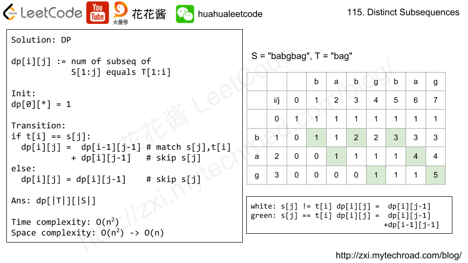

```java
class Solution {
    public int numDistinct(String s, String t) {
        /*
        mem[i+1][j+1] means that s[0...j] contains t[0...i] many times as distinct subsequences.
        The result will be mem[T.length()][S.length()]
        The first row must be filled by 1, due to the empty string is a subsequence of any string but only 1 time.
        The first column  except the first must be 0, due to an empty string cannot contain a non-empty string as subsequence.
        The rule is :
            1) if the current character is S doesn't equal to current character T, then we have
            the same number of distinct subsequences as we had without the new character.
            2) if the current character is S equal to the current character T, then the distinct
            number of subsequences is the number we had before plus the distinct number of subsequences
            that we had less long T and less long S.

        For example:
        S: [acdabefbc] and T: [ab]
        first we check with a:
        S = [acdabefbc]
        mem[1] = [0111222222]

        then we check with ab:
        S = [acdabefbc]
        mem[1] = [0111222222]
        mem[2] = [0000022244]
         */
        int lenS = s.length();
        int lenT = t.length();
        int[][] mem = new int[lenT+1][lenS+1];
        for(int j=0;j<=lenS;j++) {
            mem[0][j] =1;
        }
        for(int i=0;i<lenT;i++){
            for(int j=0;j<lenS;j++){
                if(s.charAt(j)==t.charAt(i)){
                    mem[i+1][j+1] = mem[i][j] + mem[i+1][j];
                }
                else{
                    mem[i+1][j+1] = mem[i+1][j];
                }
            }
        }        
        return mem[lenT][lenS];
    }
}
```