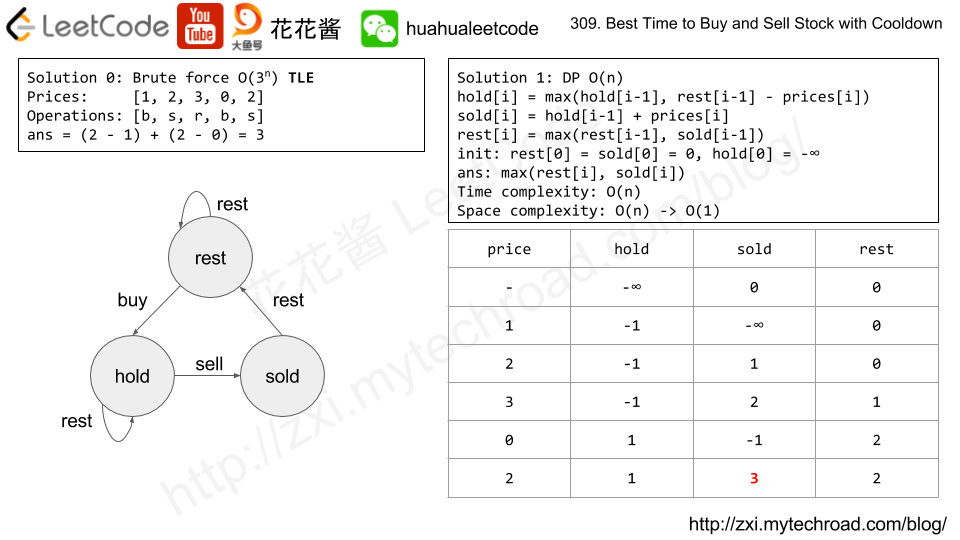

设置三个数组，分别是rest, hold, sold
* rest代表在卖出后休息的状态
* hold表示买入后持有的状态
* sold表示卖出后的状态
卖出后必须要至少休息一天， 买入后不需要休息就可以卖出

```java
class Solution {
    public int maxProfit(int[] prices) {
        int n = prices.length;
        int[] rest = new int[n+1], hold = new int[n+1], sold = new int[n+1];
        hold[0] = Integer.MIN_VALUE;
        
        for (int i = 0; i < n; i++) {
            rest[i+1] = Math.max(rest[i], sold[i]);
            hold[i+1] = Math.max(hold[i], rest[i] - prices[i]);
            sold[i+1] = hold[i] + prices[i];
        }
        return Math.max(rest[n], sold[n]);
    }
}
```