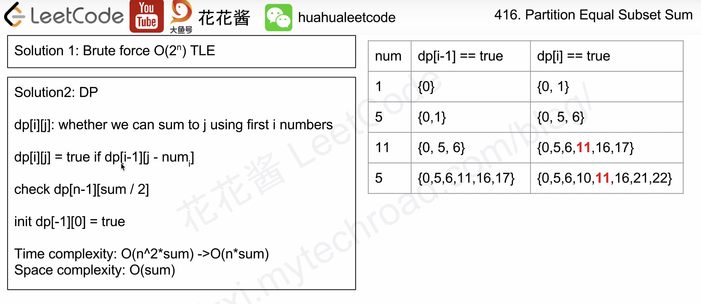

又一个背包问题。参考花花的视频：https://zxi.mytechroad.com/blog/dynamic-programming/leetcode-416-partition-equal-subset-sum/

注意这题的降维的使用，因为这题不是属于无限背包问题，每一个元素不能重复使用，所以内层循环要从右往左走，不会覆盖上一轮的结果。


```java
class Solution {
    public boolean canPartition(int[] nums) {
        int n = nums.length;
        int sum = 0;
        for (int num : nums) sum += num;
        if (sum % 2 != 0) return false;
        sum /= 2;
        boolean[] dp = new boolean[sum+1];
        dp[0] = true;
        
        for (int num : nums) {
            for (int i = sum; i >= num; i--) {
                dp[i] = dp[i] || dp[i - num];
            }
        }
        return dp[sum];
    }
}
```