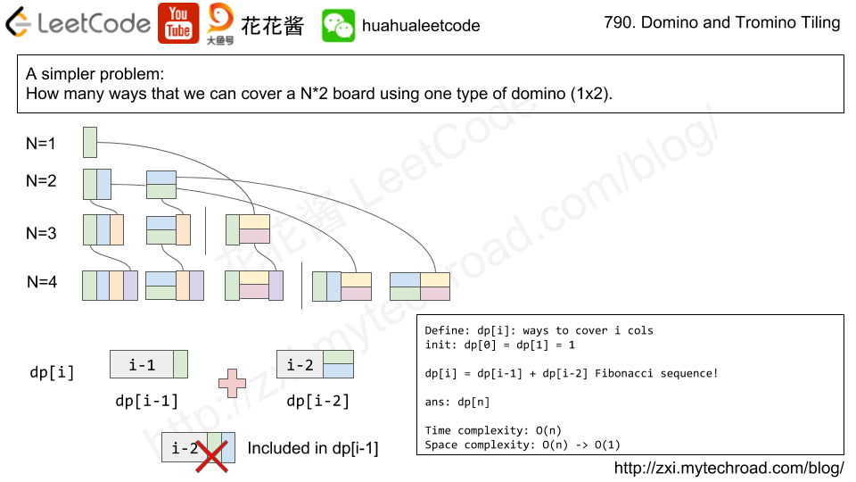
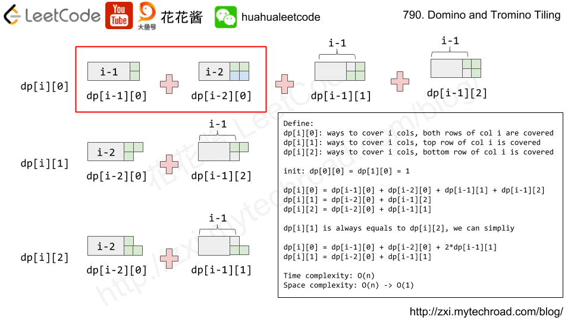

这道题应该是一道Hard的题目，难度系数标的不对。
这题参考花花的视频，讲的很清楚.https://zxi.mytechroad.com/blog/dynamic-programming/leetcode-790-domino-and-tromino-tiling/

首先可以考虑一个简单的问题，只有一种骨牌。


然后考虑如果再增加一个新的骨牌的情况


```java
class Solution {
    public int numTilings(int N) {
        int M = 1000000007;
        long[][] dp = new long[N+1][2];
        dp[0][0] = 1;
        dp[1][0] = 1;
        
        for (int i = 2; i <= N; i++) {
            dp[i][0] = (dp[i-1][0] + dp[i-2][0] + 2 * dp[i-1][1]) % M;
            dp[i][1] = (dp[i-2][0] + dp[i-1][1]) % M;
        }
        return (int)dp[N][0];
    }
}
```
