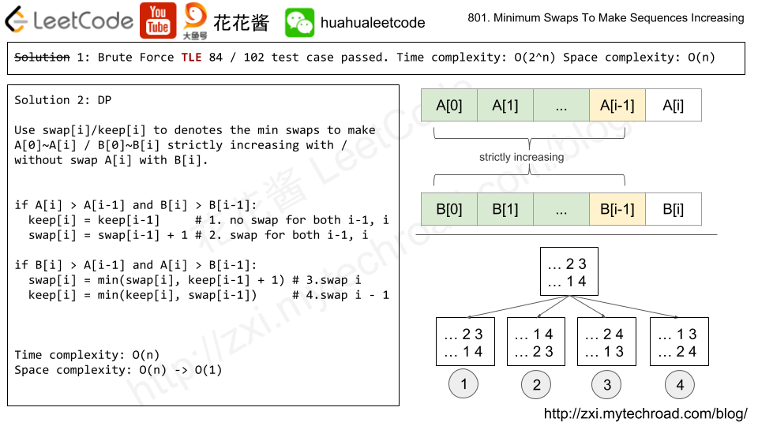

```java
class Solution {
    public int minSwap(int[] A, int[] B) {
        int n = A.length;
        int[] swap = new int[n], notswap = new int[n];
        Arrays.fill(swap, Integer.MAX_VALUE);
        Arrays.fill(notswap, Integer.MAX_VALUE);
        
        notswap[0] = 0;
        swap[0] = 1;
        
        for (int i = 1; i < n; i++) {
            if (A[i] > A[i-1] && B[i] > B[i-1]) {
                swap[i] = swap[i-1] + 1;
                notswap[i] = notswap[i-1];
            }
            if (A[i] > B[i-1] && B[i] > A[i-1]) {
                // A[i - 1] / B[i - 1] weren't swapped.
                swap[i] = Math.min(swap[i], notswap[i-1]+1);
                // Swapped A[i - 1] / B[i - 1], no swap needed for A[i] / B[i]      
                notswap[i] = Math.min(notswap[i], swap[i-1]);
            }
        }
        return Math.min(swap[n-1], notswap[n-1]);
    }
}
```